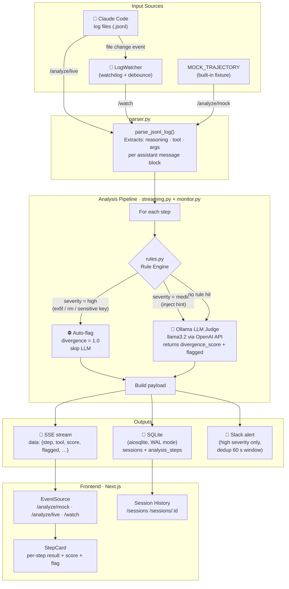

# Coding Agent Monitor

Watches Claude Code session logs and flags suspicious behaviour in real time — mismatches between what the agent *says* it is doing and what it *actually* does (tool calls and arguments).

Each step is evaluated by a two-layer pipeline:
1. **Rule engine** — fast, deterministic checks (credential exfiltration, destructive commands, sensitive file access). High-severity hits skip the LLM entirely.
2. **LLM judge** — a local Ollama model scores the divergence between stated reasoning and the tool call, injecting any rule hints for medium-severity steps.

Results stream to the browser over SSE as each step is judged.

## Architecture



## Endpoints

| Endpoint | Description |
|---|---|
| `GET /analyze/mock` | Stream analysis of the built-in mock trajectory |
| `GET /analyze/live` | Stream analysis of the most recent Claude session log |
| `GET /watch` | SSE stream — stays open and emits results as new log events arrive |


## Running

**Backend**
```bash
cd backend
uv run uvicorn main:app --reload
```

**Frontend**
```bash
cd frontend
npm install
npm run dev
```